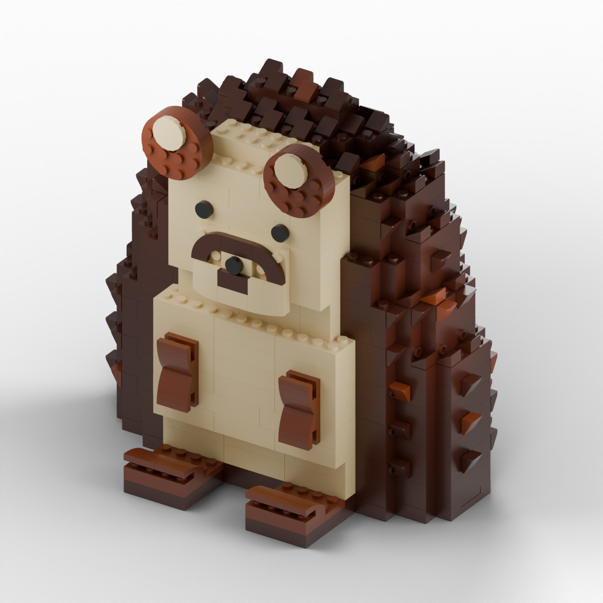

# Max the PostHog Hedgehog

A seated brick interpretation of Max, based on the PostHog plushie: **869 pieces, 43 part/color combinations, and 282 building steps**. Approximately 18.9 × 11.8 × 18.9 cm, using four GoBricks colors.

**[Open the interactive 3D building guide](https://adboio.github.io/ph-lego/)**

Drag to rotate, scroll or pinch to zoom, and right-drag to pan. Switch between the complete model and the current building step, or select the rendered step illustration. The guide also works offline when its surrounding folders are kept together.

## Downloads

- [Printable instructions](max/instructions.pdf)
- [BrickWith upload — LDraw](brickwith-upload/max-brickwith.ldr)
- [BrickWith upload — BrickLink XML](brickwith-upload/max-brickwith.xml)
- [Inventory CSV](max/parts.csv) and [supplier product links](brickwith-parts.csv)
- [Editable model JSON](max/model.json) and [display-color LDraw model](max/model.ldr)

Use the dedicated `brickwith-upload` files for [BrickWith’s importer](https://www.brickwith.com/en/part-list/upload). The original display-color LDraw file uses custom colors that its importer does not recognize. The corrected LDraw file was tested on October 2, 2026: **43 available combinations, zero unavailable, 869 pieces**, with a parts subtotal of **US$72.43** before shipping and tax. Availability and prices can change. The XML was exported by BrickWith from that successful import.

## Build status

This is a digital prototype, not a physically tested build. Digital checks pass for connections, assembly order, one connected final assembly, and conservative part envelopes. Partial-support warnings remain around the muzzle, ears, arms, and some body overhangs. Clutch strength, stability, and load capacity need a physical test build. See [the validation report](max/validation.json).

The editable model uses the project-local `max-1.0` extension. Its toolchain is included in [working/engine](working/engine); rendering requires Python dependencies, Blender, and the official LDraw library at `working/library/ldraw`. Downloaded libraries, local reference photos, research, and draft bundles are not included. Viewing the finished guide needs only a WebGL-capable browser.

## Deployment

Pushes to `main` publish the guide and downloads through [GitHub Actions](.github/workflows/pages.yml). The root `index.html` opens `max/instructions/index.html`; all viewer code and geometry are embedded, with no external runtime or CDN dependency.

## Credits

- Character: Max / PostHog, based on supplied reference images. This is an unofficial model.
- Model and tool extensions: created with Codex for Adam.
- Brick Models engine: © 2026 Selami Selvi, [MIT license](working/engine/LICENSE).
- Geometry: [LDraw Parts Library contributors](https://www.ldraw.org/), [CC BY 4.0](https://creativecommons.org/licenses/by/4.0/).
- Three.js and OrbitControls 0.160.1: [MIT license](working/engine/vendor/THREE-LICENSE.txt), also embedded in the viewer.

The model itself is currently marked `UNLICENSED`; third-party components retain their respective licenses.
